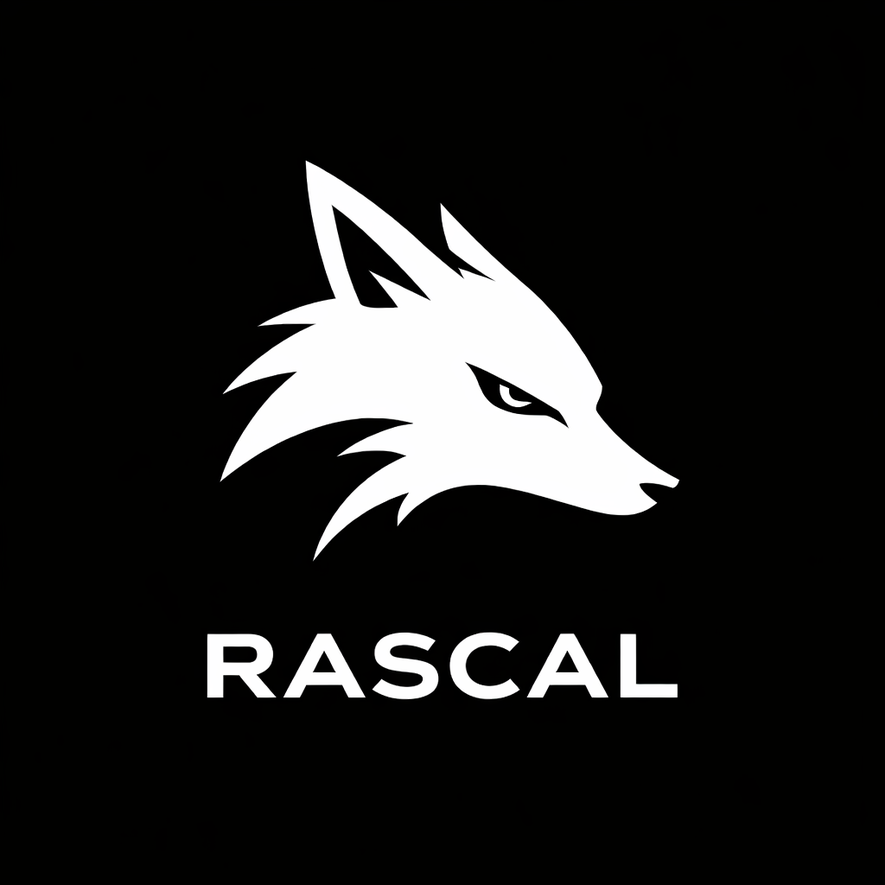
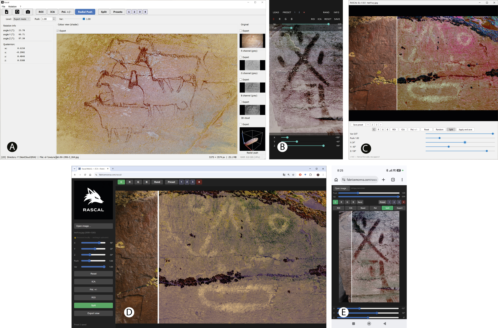

# <p align="center">RASCAL</p>

<p align="center">

</p>

<p align="center">
<b>Radial Angular Statistical Color Adaptation and Lifting</b><br>
Research software for cultural heritage imaging
</p>

<p align="center">


<br>


</p>

<p align="center">

<a href="./download/">

</a>

</p>

---

## Multiplatform software

<p align="center">

</p>

*Desktop (Windows, macOS and Linux), Android, ImageJ/Fiji, and HTML/WebGL (desktop and mobile) implementations.*

---

## Overview

RASCAL (Radial Angular Statistical Color Adaptation and Lifting) is a multiplatform software package designed to reveal subtle chromatic variations in standard RGB digital images. It was developed primarily for applications in cultural heritage and archaeological imaging, where faint colour differences may correspond to pigments, erased writings, surface alterations or archaeological structures that are difficult to perceive visually.

Unlike fully automatic enhancement methods, RASCAL relies on interactive exploration of a whitened RGB colour space. The user visually evaluates the transformations and identifies the most informative configuration.

Typical applications include:

- Medieval manuscripts and palimpsests
- Rock art
- Frescoes and wall paintings
- Archaeological aerial photographs
- Museum imaging
- Textured 3D models

---

## Key features

- Interactive ZCA whitening and colour-space rotation
- ICA-assisted orientation
- Radial Push enhancement
- Region-of-interest (ROI) processing
- GPU acceleration using OpenGL/GLSL
- Interactive 3D colour cloud
- Textured OBJ/PLY 3D model processing
- Image quality assessment
- Session recording (`.rasc`)
- Publication-grade reproducibility

---

## Processing pipeline

```text
sRGB image
      │
      ▼
Linear RGB
      │
      ▼
ZCA whitening
      │
      ├── ICA-assisted orientation
      ├── Radial Push
      ├── Push Factor
      ▼
Interactive rotation
      │
      ▼
Variance restoration
      │
      ▼
Gamma compression
      │
      ▼
Enhanced image
```

---

## Available versions

| Version | Best use |
|---------|----------|
| **Desktop** | Complete reference implementation for demanding scientific work, publication figures and textured 3D models. |
| [**HTML/WebGL**](https://fabricemonna.com/rascal/) | Demonstration, teaching and quick exploration without installation. |
| **ImageJ/Fiji** | Integration into ImageJ/Fiji scientific imaging workflows. |
| **Android** | Field exploration on phones and tablets. |

A detailed comparison of all implementations is available in:

[`documentation/RASCAL_version_comparison.pdf`](./documentation/RASCAL_version_comparison.pdf)

---

## Download

Ready-to-use installers and plugins are available in the [`download/`](./download/) directory.

| Platform | Package | Installation |
|----------|---------|------------|
| Windows | [`.msi`](./download/) | Run the installer and follow the wizard. |
| Linux | [`.AppImage`](./download/) | Make executable and run directly. |
| macOS (Intel & Apple Silicon) | [`.dmg`](./download/) | Mount and drag to Applications. |
| Fiji | [`.jar`](./download/) | Copy `Rascal_GL.jar` into the `plugins/` folder. |
| ImageJ  | [`.jar`](./download/) | Copy `Rascal_GL-standalone.jar` into the `plugins/` folder. |
| Android | [`.apk`](./download/) | Install from the device file manager. |

Platform-specific installation notices are provided in [`download/README.md`](./download/README.md).

---

## Repository organisation

```text
RASCAL/
├── desktop/
├── imagej/
├── android/
├── web/
├── documentation/
├── reproducibility/
├── download/
└── releases/
```

---

## Documentation

The [`documentation/`](./documentation/) directory contains:

- [Desktop User Manual — Windows, macOS & Linux](./documentation/desktop/)
- [Android User Manual](./documentation/android/)
- [ImageJ/Fiji User Manual](./documentation/imagej/)
- [Web / WebGL User Manual](./documentation/web/)
- [Linux-specific notes](./documentation/linux/)
- [Detailed version comparison](./documentation/RASCAL_version_comparison.pdf)

---

## Reproducibility

The [`reproducibility/`](./reproducibility/) directory contains the `.rasc` session files used to generate the figures of the associated publication. The key element for reproducibility is the **`.rasc` session file**: it records the exact processing parameters (whitening matrix, rotation, push factor, etc.) applied to each image. Loading a `.rasc` file in RASCAL reproduces the result exactly, enabling independent verification of the published figures.

The corresponding sample images (`.tif` and `.jpg`) are provided in the [`images_test/`](./images_test/) directory. Several of them correspond directly to the figures of the article.

This facilitates FAIR scientific data management and enables independent verification of the published results.

---

## Citation

If you use RASCAL in academic work, please cite the associated publication:

> **Interactive rotation in whitened RGB space for enhancing subtle chromatic features in heritage imaging: the RASCAL multiplatform software**
>
> Fabrice Monna, Jean-Loïc Le Quellec, Yury Esin, Aurélia Bully, Tanguy Rolland, Christian Sapin, Nicolas Navarro, Pierre-Stanislas Nouvel, Josef Wilczek, Anne-Caroline Allard, Jérôme Magail
>
> *Submitted to Journal of Cultural Heritage.*

---

## License

RASCAL is distributed under the terms of the **GNU General Public License v3.0**  
(**GPL-3.0**).

This means that you are free to use, study, modify, and redistribute the software, including modified versions, provided that the same GPL-3.0 license is preserved. In particular, if you redistribute RASCAL or a derivative version, the corresponding source code must also remain available under the GPL-3.0.

The GPL-3.0 license was chosen to ensure that improvements to the software remain open and reusable by the scientific, educational, and cultural heritage communities.

See the [`LICENSE`](LICENSE) file for the full legal text.

---

## Contact

**Fabrice Monna**  
UMR 6298 ARTEHIS  
Université Bourgogne Europe, Dijon, France

Fabrice.Monna@u-bourgogne.fr
